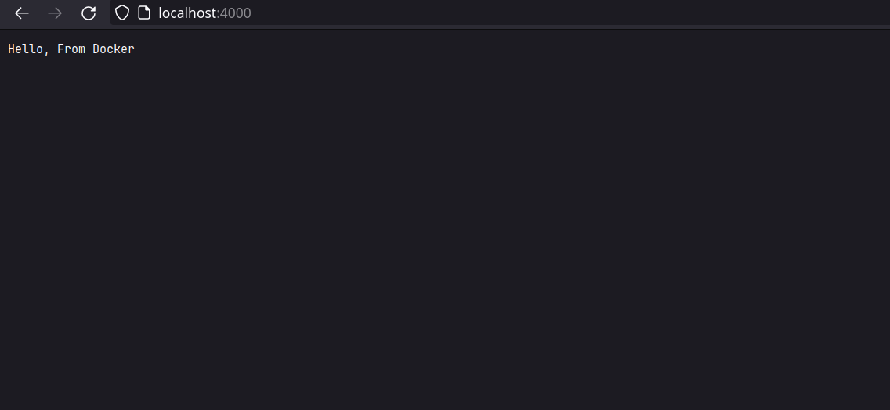

# REPORT

1. Создал Dockerfile и определил его.
```Dockerfile
FROM ubuntu:20.04
COPY ./go ./go 
# Будет дешевле, если я просто перенесу компилятор сюда
WORKDIR /app
COPY ./webapp/* ./
RUN /go/bin/go build -o webapp main.go
# Собираю бинарник приложения, чтобы не ждать лишний раз
CMD ["./webapp"]
```

2. Собрал докер-образ
```bash
$ docker buildx build -t go-webapp:1.0 .

[+] Building 1.5s (10/10) FINISHED                                                                                         docker:default
 => [internal] load .dockerignore                                                                                                    0.1s
 => => transferring context: 61B                                                                                                     0.0s
 => [internal] load build definition from Dockerfile                                                                                 0.2s
 => => transferring dockerfile: 158B                                                                                                 0.0s
 => [internal] load metadata for docker.io/library/ubuntu:20.04                                                                      0.0s
 => [1/5] FROM docker.io/library/ubuntu:20.04                                                                                        0.0s
 => [internal] load build context                                                                                                    0.7s
 => => transferring context: 814.21kB                                                                                                0.6s
 => CACHED [2/5] COPY ./go ./go                                                                                                      0.0s
 => CACHED [3/5] WORKDIR /app                                                                                                        0.0s
 => CACHED [4/5] COPY ./webapp/* ./                                                                                                  0.0s
 => CACHED [5/5] RUN /go/bin/go build -o webapp main.go                                                                              0.0s
 => exporting to image                                                                                                               0.1s
 => => exporting layers                                                                                                              0.0s
 => => writing image sha256:5e30384db7003895848b28cbe851229fbe10b4c330bf3dcb2dad0a571299c32d                                         0.0s
 => => naming to docker.io/library/go-webapp:1.0 
```
3. Запустил приложение основанное на докер-образе.

```bash
$ docker run --rm --detach -p 4000:4000 go-webapp:1.0

f3a4f24937aef47a3fed4276df8a03ae44320855748660df4add424675cd796d
```

