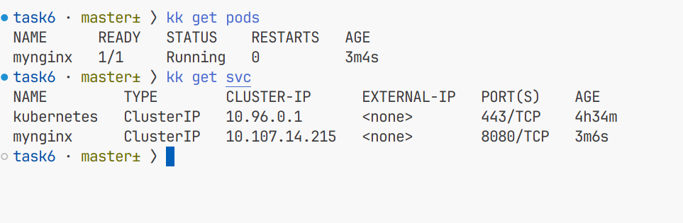

# REPORT

1. Запустил кластер и проверил его состояние

2.1 Написал файл манифеста для пода. 

2.2 Написал файл манифеста для сервиса 

2.3 Запуск пода и соответствующего сервиса. 

3. Проверка пода и сервиса.

    3.1 Проверка в браузере.
    

    3.2 Проверка наличия пода и сервиса.
    

    3.3 Проверка состояния пода.
    

4. Журналы и отладка

4.1 Логи

4.2 Shell пода

5. Удаление ресурсов

6. Остановка minikube

