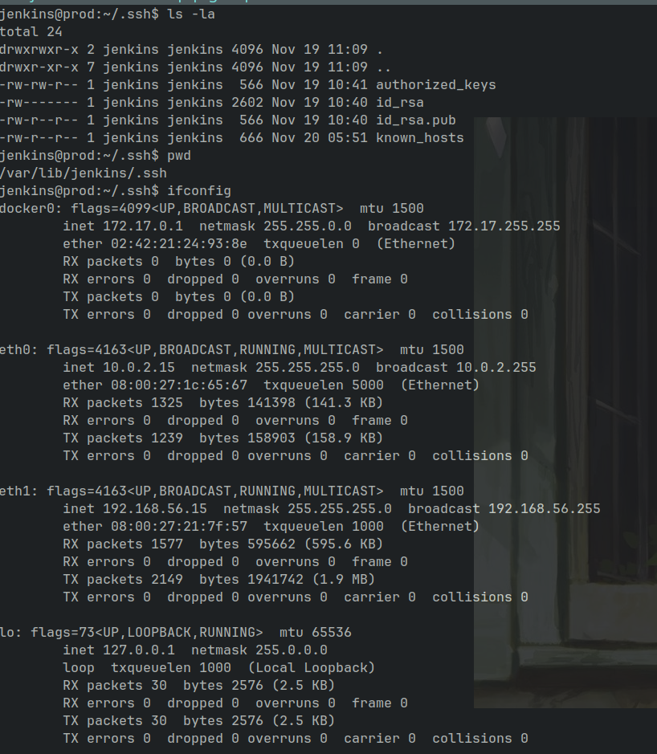
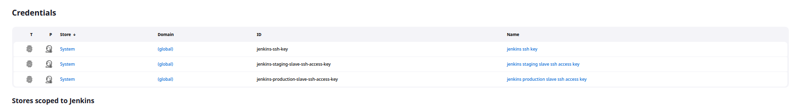

# Jenkins

Virtual machines:

Project repo: `https://github.com/ppaprikaa/http-server`

staging-branch jenkinsfile:

master-branch jenkinsfile:

jenkins production pipeline config:

* Тут я думал над тем, чтобы триггерить работу pipeline через GitHub Actions Workflow, но это не представляется возможным т.к всё запускается локально, а возня с вебхуками, которые должны работать, но не работают меня не устраивает, потому я не заморачивался над тем, чтобы триггерить pipeline на слиянии мастера с другой веткой.

result:

jenkins staging pipeline config:

result:

* Всё собирается на подчиненных серверах, каждый из них содержит пользователя jenkins, который содержит свой приватный и публичный ключ для подключения по ssh, работы с GitHub-ом и запуска главным узлом.

Пример:
Prod-узел

* Ключи ssh добавлены в качестве credentials для безопасного доступа и переиспользования

* Конфигурация staging-узла

* Запуск staging-узла
