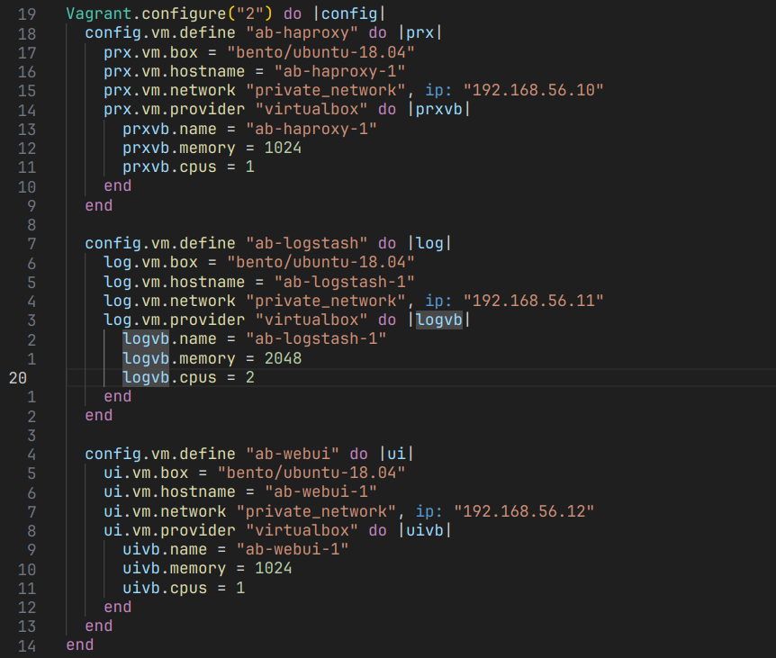

# Ansible

## Машины

1. haproxy - машина, на которой запущен демон monit, который мониторит, перезапускает, может отключить лоад балансера haproxy, который в свою очередь перенаправляет трафик на машину webui.

2. logstash - машина, на которой запущен logstash и elasticsearch, логи приходят на tcp сервер logstash-а и перенаправляется в elasticsearch.

3. webui - машина, на которой запущена kibana, доступ к которой можно получить только через nginx, которая собирает данные с elasticsearch, на logstash, так же машина на которой запущен rsyslog, который собирает системные логи и перенаправляет логи на tcp сервер logstash-а.

* rsyslog(webUI) => logstash(logstash) => elasticsearch(logstash) => kibana(webUI) => nginx(webUI) => haproxy(haproxy)

И всё это настроить через Ansible

и так по ролям, ab-haproxy содержит в себе следующие роли: `apt, ntp, monit, haproxy`, ab-logstash: `init, apt, ntp, monit, logstash, elasticsearch`, ab-webui: `init, apt, ntp, monit, rsyslog, kibana, nginx`